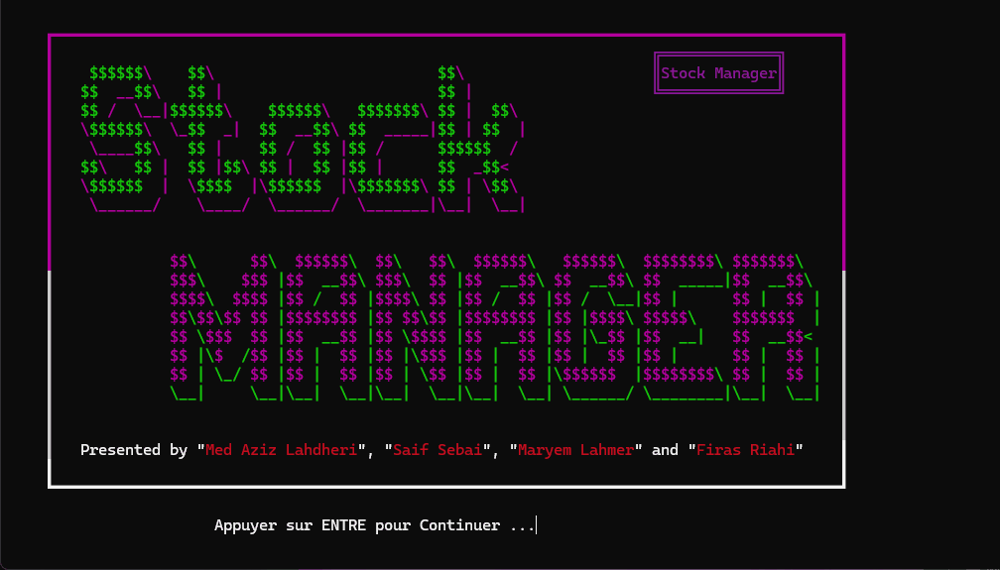

# Stock-Manager
A program to help store owners manage their stocks.

Use our user friendly interface to enter and edit your stock data which is then saved to [Database/stock.csv](https://github.com/MedAziz218/Stock-Manager/blob/main/Database/stock.csv).

The program also keeps track of all operation and conviniently saves it to a csv file in  [Database/history.csv](https://github.com/MedAziz218/Stock-Manager/blob/main/Database/history.csv).

## Here are a few screenshots :

## Main Menu Preview

## Adding Product 

## Stock Preview

## History Preview

# Demo
